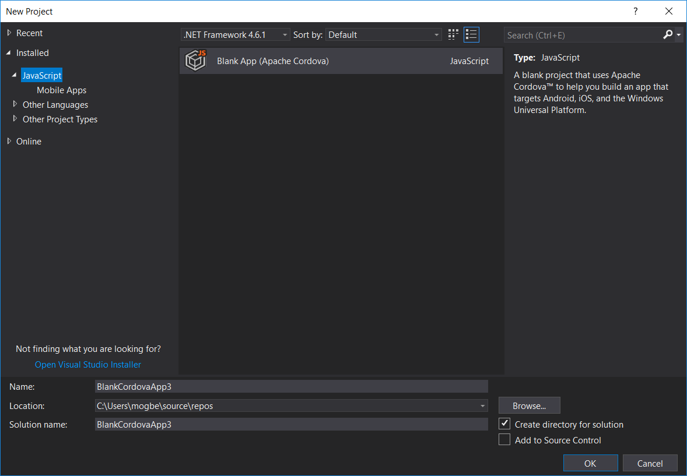
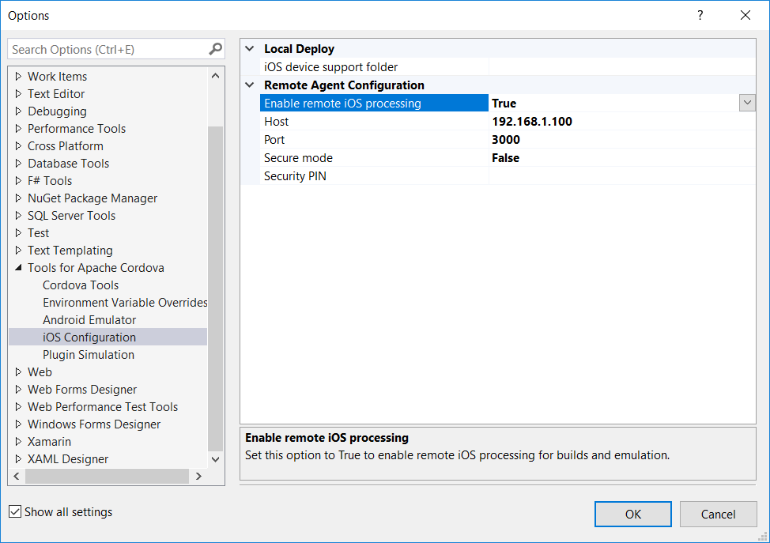
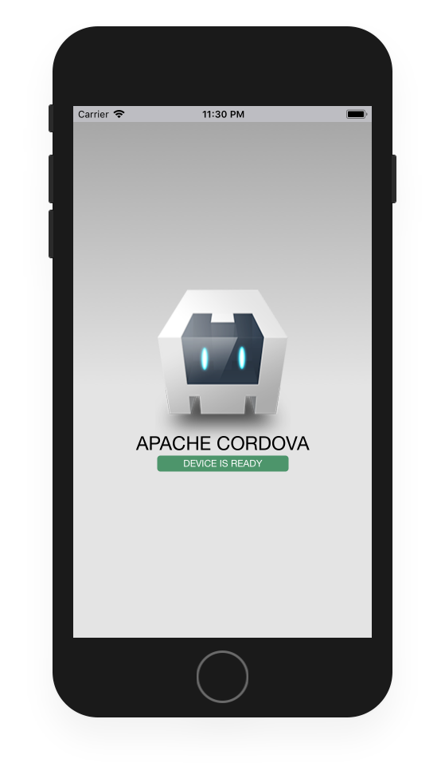
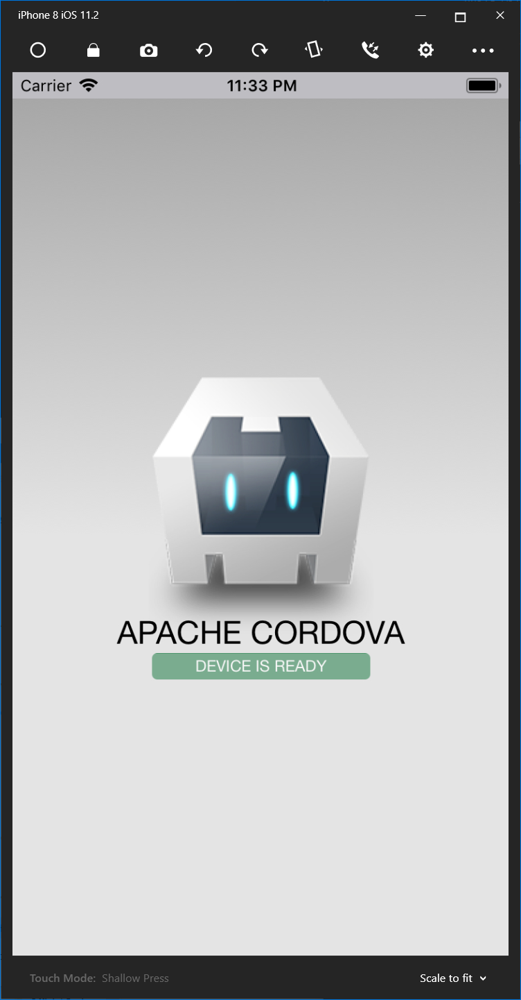
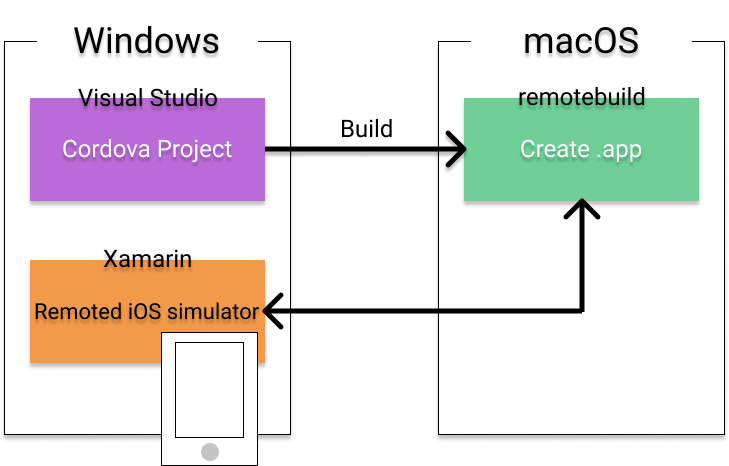

# This is workaround, Run Cordova iOS simulator on Windows from macOS iOS simulator using Visual Studio.

**This is no support debug mode.**

**Just run remote simulator in the Cordova project of Windows.**

## Step1. Setting macOS

### Install Visual Studio for Mac.

https://www.visualstudio.com/vs/visual-studio-mac

### Install remotebuild.

```
brew install nodejs
```

```
npm install -g remotebuild
```
***If you were installed brew already, press enter 3 times.***

### Allow remote login.

Open "System Preferences > Sharing".

Check "Remote Login" enabled.

## Step2. Setting Windows

### Install Visual Studio.

https://www.visualstudio.com/downloads/

### Setting remotebuild on Cordova project.

Login your macOS on Windows terminal and run remotebuild.

```
ssh yourmacuser@xxx.xxx.xxx.xxx
remotebuild
```

**Remember port and pin code.**

Create Cordova project.



Open "Tools > Options > iOS Configuration" on Visual Studio.



Click "OK" and connect to your mac OS. You can see log via login terminal.

Run your Cordova project, target iOS.


You can see iOS simulator on your macOS.



## Step3. Run iOS simulator on windows

Login your macOS on Windows terminal and run commands.

```
ssh yourmacuser@xxx.xxx.xxx.xxx
find ./taco_home -name '*.app'
```

Remember above app path.

Replace {3 placeholders} and execute commands on command prompt.

```
cd C:\Program Files (x86)\Xamarin\Simulator
Xamarin.Simulator.Windows.exe ^
--device=B52A3C48-61C5-4E60-800E-9E92B56B851E ^
--launchsim="{Result path of find ./taco_home -name '*.app'}" ^
--sdkroot="/Applications/Xcode.app" ^
-h={mac OS ip address} ^
-ssh="{macOS user}"
```

Launch iOS simulator on Windows.



## Last. Development iOS app.

If you were change code on Visual Studio, press F6 (build app) and re-execute "Xamarin.Simulator.Windows.exe" with arguments.



Let's enjoy!

## Other tips

Device argument of above command are below.

|  Device  |  device ID  |
| ---- | ---- |
|  iPhone SE  |  34B82FFF-9C9A-4FE5-B2A5-61E1C69626A5  |
|  iPhone 8  |  B52A3C48-61C5-4E60-800E-9E92B56B851E  |
|  iPhone 8 Plus  |  2C9631E9-15DA-4AF5-B5D1-B06A04E31190  |
|  iPhone X  |  E15C45D8-1036-4DC2-9E7E-157A95B983D4  |

You can see device ID below executing command on command prompt while execute Xamarin project.

```
wmic path win32_process get name, commandline
```
